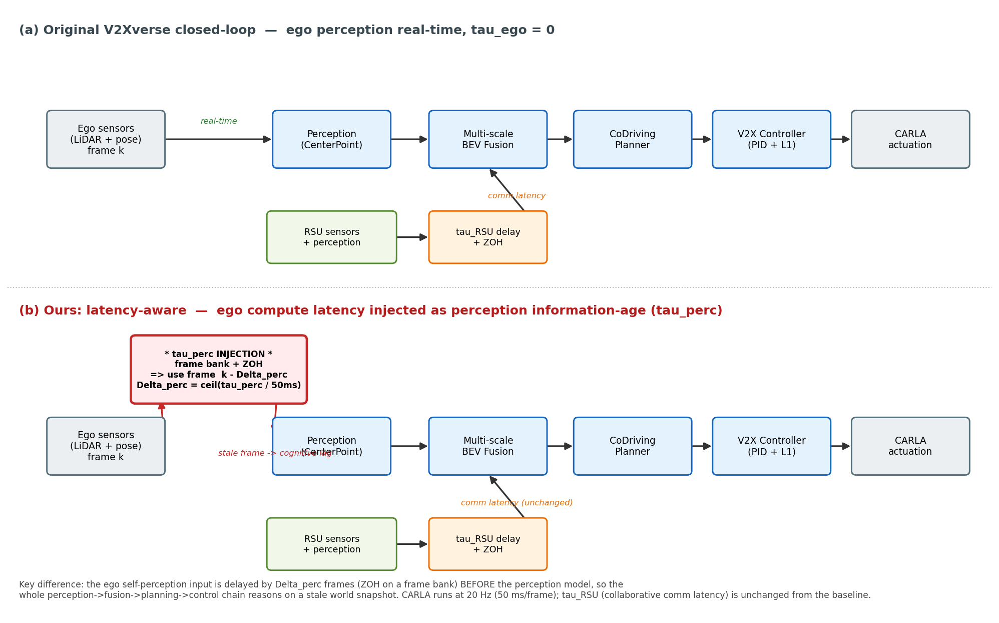

# 实验·闭环仿真：时延感知的设计与延迟注入

> 论文 Experiments 小节中文稿 (v1, 2026-06-17)。放置位置 = §6 Experiments 中，承接 §6.1 评测协议（`experiments_eval_protocol_zh_v1.md`），作为闭环驱动分实验的环境与方法学说明（在闭环 Main Results 之前）。
> 设计依据：`multi_agent/real_test/sim_ego_rsu_latency_strategy_v1.md`（两路径时延物理模型）、`sim_h800_ipc_split_v1.md`（双进程 IPC）、`sim_framework_overview_v1.md`（框架总览）。
> 实现：`simulation/leaderboard/team_code/pnp_infer_action_e2e.py`（感知链路注入，第 704–718 行）。
> 配图：`multi_agent/figure/data/sim_arch_compare.png`。

---

## 6.x 闭环仿真：时延感知的设计与延迟注入

### 动机

软硬件协同加速的最终价值，必须落在**闭环驾驶安全**上才算被证明：更激进的剪枝与量化降低自车的端到端推理时延，更低的时延意味着对环境变化更快的反应，从而在避障、让行等安全攸关场景中获得更高的驾驶分。这条"**加速 → 更快反应 → 更安全**"的因果链，是把我们的加速工作与下游收益连接起来的核心论证。然而，常规的开环精度/时延评测无法触及它：开环指标只回答"模型多快、多准"，却不回答"快 0.1 秒在闭环里值多少驾驶分"。

要把这条因果链变成**可测曲线**，仿真必须满足两个条件：其一，自车的推理时延要作为一个**物理量**真实地作用于闭环——不同加速档对应不同的反应滞后，否则所有配置在闭环里反应快慢相同，加速对驾驶分的边际收益恒为零；其二，时延必须注入在管线的**正确位置**，使其表达的物理含义与真实系统一致。本节描述满足这两个条件的时延感知闭环仿真：先给出运行架构，再给出延迟注入的物理模型与实现，最后说明注入点的选择为何决定信号的有无。

### 闭环运行架构

我们在 CARLA 0.9.10（Town05，leaderboard 协议，105 条路线）上构建协同驾驶闭环，被测系统为 CoDriving 协同感知–规划栈：感知为 CenterPoint 检测加多尺度注意力融合，规划为 WaypointPlanner（MotionNet），控制为 V2X_Controller（PID）叠加 L1 轨迹跟踪。每个仿真步（CARLA 以 20 Hz 运行，即 50 ms/帧）的控制流为：自车与路侧（RSU）传感器采集 → 感知 → 多尺度 BEV 融合 → 协同规划 → 控制器 → 回灌 CARLA 执行。

由于目标硬件栈（sm90）要求感知模型运行于 torch2 而 CARLA 客户端仅支持 py3.7，我们将闭环拆为**双进程**并以 zmq + msgpack_numpy 通信：进程 A（py3.7）承载 CARLA、leaderboard 与传感/控制 I/O；进程 B（torch2/py3.10）承载感知–规划"整脑"于 GPU 上，跨帧状态（L1 轨迹库、时延对齐器）常驻于 B。两进程绑定不同 GPU 实现**算力隔离**——CARLA 渲染与感知推理互不抢占，从而保证时延测量纯净；该配置实测稳定运行 4600 帧以上、约 130 ms/帧。算力隔离不仅是工程便利，更是时延实验的前提：只有当推理与渲染不相互干扰时，注入的 $\tau$ 才等于自车真实承受的反应滞后。

### 两条路径、两个旋钮：延迟的物理模型

协同驾驶系统中存在两类时延，作用于管线的**不同位置**，绝不能合成为一个标量。我们以**逐路径信息年龄（per-path information age）**为统一量，并按 CARLA 帧率全部量化为帧数。

- **协作路（RSU/CAV）**：信息年龄 $\mathrm{age}_{\text{collab}} = \tau_{\text{collab-compute}} + \tau_{\text{comm}} + \tau_{\text{wait}}$，刻画协作 BEV 从算完、传输到等到融合时已有多旧。它注入在**融合之前、仅作用于 RSU 分支**：$\Delta_{\text{RSU}} = \lceil \mathrm{age}_{\text{collab}} / 50\,\text{ms} \rceil$ 帧后推 + 零阶保持（ZOH），**不改变自车出控制的时刻**，只改变协作信息的新鲜度，从而间接影响融合质量。该路径为 V2Xverse 基线已建。

- **自车路（ego）**：信息年龄 $\mathrm{age}_{\text{ego}} = \tau_{\text{ego-compute}}$，即自车端到端推理时延。它表达的是"基于第 $k$ 帧数据算出的决策，要到第 $k+\Delta_{\text{ego}}$ 帧才生效"，因此必须使整条自车感知→融合→规划→控制链**整体滞后** $\Delta_{\text{ego}} = \lceil \tau_{\text{ego}} / 50\,\text{ms} \rceil$ 帧。这正是本文加速工作在闭环中的投影：基线 $\tau_{\text{ego}}=0$（理想机）下不同加速档反应相同，而注入真实 $\tau_{\text{ego}}$ 后，加速带来的滞后差异才在驾驶分上显形。

两者正交：$\tau_{\text{RSU}}$ 只改"协作内容有多旧"，$\tau_{\text{ego}}$ 改"整个决策何时可用"。在第 $k$ 帧，自车执行的决策来自第 $k-\Delta_{\text{ego}}$ 帧，而那一刻所融合的 RSU 信息又是 $\Delta_{\text{RSU}}$ 帧旧的——两延迟**串联**，总协作信息年龄为 $\Delta_{\text{ego}}+\Delta_{\text{RSU}}$ 帧，与真实系统一致。

### 延迟注入：感知链路注入

图 1 对比了基线架构（a）与本文的时延感知架构（b），并突出延迟的注入位置。基线中自车感知为实时（$\tau_{\text{ego}}=0$）；本文在**自车原始传感器输入与感知模型之间**注入自车时延——我们称之为**感知链路注入**。

> **图 1**　原始 V2Xverse 闭环（上）与本文时延感知闭环（下）的对比。延迟注入点（红框）位于自车自感知输入处，在感知模型之前；自车在第 $k$ 帧获得的是第 $k-\Delta_{\text{perc}}$ 帧的世界快照（陈旧点云 + 陈旧位姿），使整条感知→融合→规划→控制链在过期信息上推理。协作路的 $\tau_{\text{RSU}}$ 与基线一致。

实现上（`pnp_infer_action_e2e.py` 第 704–718 行），在感知模型执行之前，我们将自车的完整输入 `car_data_raw[0]`（LiDAR 点云 + 位姿/measurements）以仿真步号为键存入一个**帧库（frame bank）**，再以**零阶保持**取出键值 $\le k-\Delta_{\text{perc}}$ 的最新一帧，替换当前帧作为感知输入；其中 $\Delta_{\text{perc}} = \min(\lceil \tau_{\text{perc}}/50\,\text{ms}\rceil,\,20)$，上限 20 帧对应 1000 ms。两处工程细节是正确性的关键：（i）存取均**深拷贝**，因为下游预处理会对点云做原地翻转（`lidar[:,1]*=-1`），且 ZOH 会重复取用同一帧，浅引用将污染帧库；（ii）旧帧按窗口及时清理以控制内存。由于延迟的是**整帧**（点云与位姿一并后推），其语义是 warp 一致的——自车看到的是一个完整、自洽但过期的世界快照，等价于端到端推理延迟的物理效果，而非人为割裂的部分滞后。

注意延迟是按**帧量化**的：CARLA 20 Hz 决定传感器数据只在每 50 ms 才有一帧，因此可实现的时延状态是 50 ms 的整数倍（$\Delta_{\text{perc}}$ 帧），无法表达"3.2 帧"这类亚帧延迟。这是仿真器的物理约束而非实现选择，也界定了时延曲线的分辨率下限。

### 注入点的选择：为什么是感知输入而非规划输出

自车时延原则上可注入在两个位置：**规划输出端**（延迟轨迹生效，由 L1 控制器沿旧轨迹按时间索引推进）或**感知输入端**（如上）。我们对两者均做了 N=3 严格配对的闭环实测，结论是注入点决定信号的有无：

- **规划输出注入 = 空信号**。延迟轨迹的生效时刻，其危害被控制器与轨迹本身的时间冗余吸收——自车"已经看见"障碍并算出了应对，只是执行稍晚，多数场景下控制器仍能沿既定轨迹完成避让。在全交通流 N=3 配对下，该注入下的驾驶分与零延迟基线无可分辨差异。

- **感知输入注入 = 单调退化信号**。延迟自感知输入意味着自车在一段时间内"还没看见"新出现的障碍——认知滞后导致晚发现、晚决策、晚执行，直接转化为碰撞与驾驶分下降。

二者的差别揭示了延迟危害的本质：**伤害驾驶的是对世界的认知滞后，而非计划执行的滞后**。规划滞后被下游冗余吸收，认知滞后则无可挽回。因此本文以感知链路注入作为自车时延的物理载体，它也正确建模了"端到端推理慢 → 整个世界认知滞后"的真实机理。

### 测量口径

闭环驾驶分以 leaderboard 的 score_composed（路线完成度 × 各类违规惩罚连乘）为准。一个关键口径是对**灾难性失败**的处理：当高延迟导致自车长时间盲驾、episode 无法在限定步数内正常收尾（被超时机制中止）时，该次运行**记为 DS=0**而非从统计中剔除——剔除会系统性地丢弃最坏结果，使高延迟档被乐观高估。为隔离环境噪声，统计仅在零延迟下表现干净（DS≈100、无碰撞）的路线子集（tp0-clean）上、按各延迟档配对进行。完整的指标定义与多目标前沿见 §6.1。
